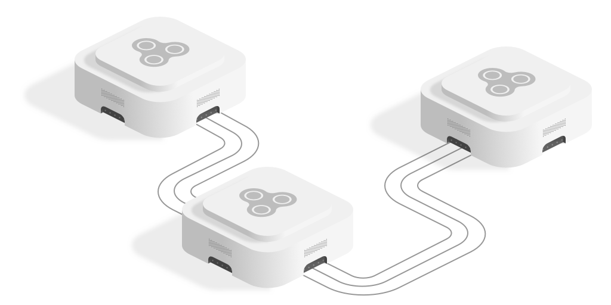

# INTER-CONNECTIBILITY

a service is called (in the context of this document) **inter-connectible** if it provides its public API 
in the same manner that CONNECT instances do. services that are **inter-connectible** can be connected 
to via CONNECT-platform's services feature, which allows them to automatically add wrapper nodes for each public end-point
of the service, making using this services within the platform extremely convenient. additionally we also believe 
(firmly, no kidding) that this is a nice format for communicating micro-service APIs (in a little bit higher level
and hence more human readable format than alternatives at least).

## location

the public API should be accessible on `/api` sub-path of the root URL of the service. for example, if the service is to be accessible via `https://example.io`, then the API should be accessible via `https://example.io/api`. the term **root URL** here simply means the addresses of all end-points of the API should be sub-paths of this URL, so for example if the root URL of your service is 
 ```
 https://another.example.io/some/arbitrary/sub-path/
 ```
 
then the api should reside on 
```
https://another.example.io/some/arbitrary/sub-path/api
``` 

and the absolute address of all of the end-points should start with 
```
https://another.example.io/some/arbitrary/sub-path/
```

## format

### general

the public API should be in a simple, plain JSON text format (i.e. text that is written in compliance with JSON format). to be more specific, it should be a JSON array containing the signatures of all of the publicly available end-points. it should be returned in response to `GET` requests to the `/api` address.

this is an example of proper response:

```JSON
[
  {
    "path": "/",
    "public": true,
    "outputs": ["msg"]
   }
]
```

which means there is an end-point accessible on the root URL of the service, which requires no inputs and provides a JSON object with a key `msg` as an output. more on that in the following section.

in the following sections, optional and mandatory fields of each signature objects will be outlined, alongside the behaviour or characteristics of the respective endpoint they should be indicative of.

### path

each signature object should include a path, which is the path at which the end-point is accessible. the path should be relative to the **root URL** of the service. so for example, for a service located at `https://example.com/stuff/`,
if the response to get requests to `https://example.com/stuff/api` is like this:

```JSON
[
  {
    "path": "/",
    "public": true,
    "outputs": ["msg"]
   },
   {
    "path":"/hellow",
    "public": true,
    "inputs": ["to"],
    "outputs": ["greet"],
   }
]
```

then this service should avail two end points on `https://example.com/stuff/` and `https://example.com/stuff/hellow`.

paths are main identifiers of each signature (and subsequently the endpoint they represent), so the `path` property of each signature object should be distinct.

#### parametric paths

end-points can also mark parametric paths. for example, a path marked as `https://example.com/stuff/send/:something/to/:someone` is a path with two parameters: `something` and `someone`, and the same end-point should be responding to all of the following paths:

* `https://example.com/stuff/send/regards/to/that-dude`
* `https://example.com/stuff/send/gratitude/to/42`
* `https://example/com/stuff/send/903284-09234/to/null`
* ...

the parameters in the url should be also included in the `inputs` part of the signature of the end-point. see (inputs)(#inputs) for more information.

### public [optional]

indicates whether this endpoint is to be accessible publicly or not. for endpoints exposed to the public this field usually does have a `true` value, so it is entirely optional.

### method [optional]

the http method to be used when requesting this endpoint. can be one of `get`, `put`, `post` and `delete`. note that this is just to mark with which method the endpoint should be invoked and is not to be considered part of the identifier of the signature or the endpoint, i.e. there should not be two signatures with the same path and different methods in the same api response.

method should also generally be indicative of properties of the endpoint, however these characteristics are recommendations and not part of this specification:
- `get` endpoints should just read some state. they should not mutate any state and instantly subsequent invokations of them should have the same result. the response usually should be some data.
- `put` endpoints should modify the state. instantly subsequent invokations of them should yield the same result. the response usually should be status report (done or failed).
- `post` endpoints should append to the state. instantly subsequent invokations of them should yield different results. the response usually should be identifiers that can later be utilized via `put`, `delete` and `get` methods to  to modify the appended part of the state.
- `delete` endpoints should delete from the state. instantly subsequent invokations of them should yield the same result. the response usually should be status report (done or failed).

example:

```JSON
[
  {
    "path": "/remember",
    "public": true,
    "method": "put",
    "inputs": ["the_name"],
    "controlOutputs": ["done", "failed"]
  },
  {
    "path": "/forget",
    "public": true,
    "method": "delete",
    "inputs": ["the_name"],
    "controlOutputs": ["done", "could_not_remember_in_the_first_place", "failed"]
  },
  {
    "path": "/add-note",
    "public": true,
    "method": "post",
    "inputs": ["the_name", "note"],
    "outputs": ["note_number"],
    "controlOutputs": ["do_not_know_that_name", "failed"]
  },
  {
    "path": "/recall",
    "public": true,
    "method": "get",
    "inputs": ["the_name"],
    "outputs": ["notes"],
    "controlOutputs": ["do_not_know_that_name", "failed"]
  }
]
```
